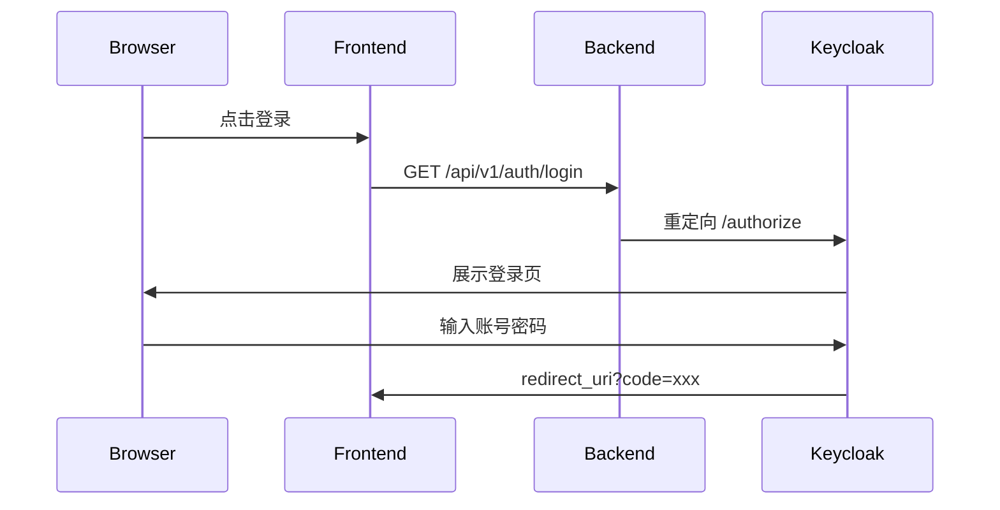
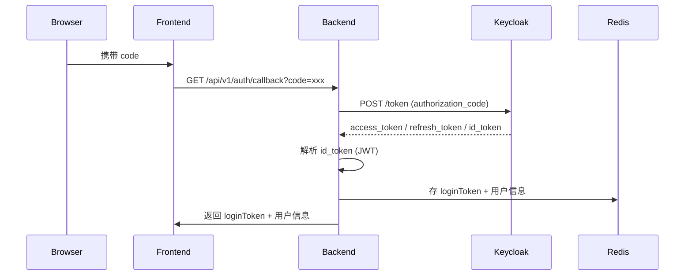
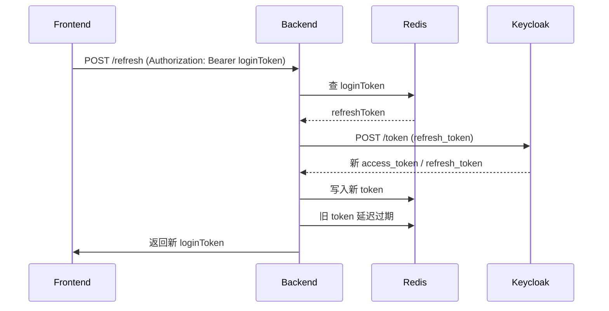
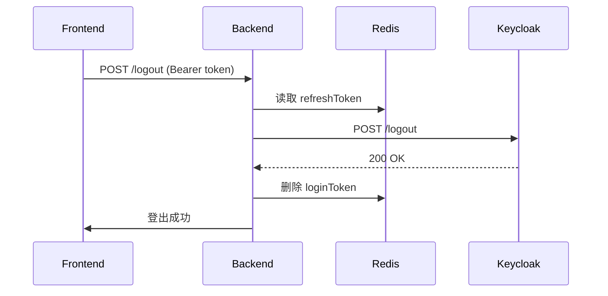

#### 环境初始化

- 创建docker网络

```shell
docker network create infra-net
```

- docker启动redis

```shell
docker run -d \
  --name redisdb \
  --network infra-net \
  --restart unless-stopped \
  -p 6379:6379 \
  -v /data/redis:/data \
  redis:7.2 \
  redis-server --requirepass "123456" --appendonly yes

```

```shell
docker run -d \
  --name mariadb \
  --network infra-net \
  --restart unless-stopped \
  -p 3306:3306 \
  -e MYSQL_ROOT_PASSWORD=123456 \
  -v /data/mariadb:/var/lib/mysql \
  mariadb:10.11

```

- 创建账号

```shell
docker exec -it mariadb mysql -u root -p123456

CREATE DATABASE IF NOT EXISTS keycloak CHARACTER SET utf8mb4 COLLATE utf8mb4_unicode_ci;

CREATE USER 'keycloak'@'%' IDENTIFIED BY '123456';
GRANT ALL PRIVILEGES ON keycloak.* TO 'keycloak'@'%';
FLUSH PRIVILEGES;
EXIT;


```

- docker启动keycloak

```shell
docker run -d \
  --name keycloak \
  --network infra-net \
  -p 8080:8080 \
  -e KEYCLOAK_ADMIN=admin \
  -e KEYCLOAK_ADMIN_PASSWORD=admin \
  -e KC_DB=mariadb \
  -e KC_DB_URL=jdbc:mariadb://mariadb:3306/keycloak \
  -e KC_DB_USERNAME=root \
  -e KC_DB_PASSWORD=123456 \
  -e KC_HOSTNAME=localhost \
  -e KC_HOSTNAME_STRICT=false \
  -e KC_HTTP_ENABLED=true \
  quay.io/keycloak/keycloak:25.0 \
  start-dev

```

#### docker构建&启动

```shell
# 构建
docker build -t oidc:1.0 .

# 启动
docker run -d \
  --name oidc \
  --network infra-net \
  -p 10052:10052 \
  oidc:1.0

```

- 配置本地host

```shell
sudo vi /etc/hosts

127.0.0.1       mariadb
127.0.0.1       mongodb
127.0.0.1       redisdb
127.0.0.1       keycloak
```


#### 交互流程

- jump to sso login



- sso login callback get token



- refresh token



- logout

