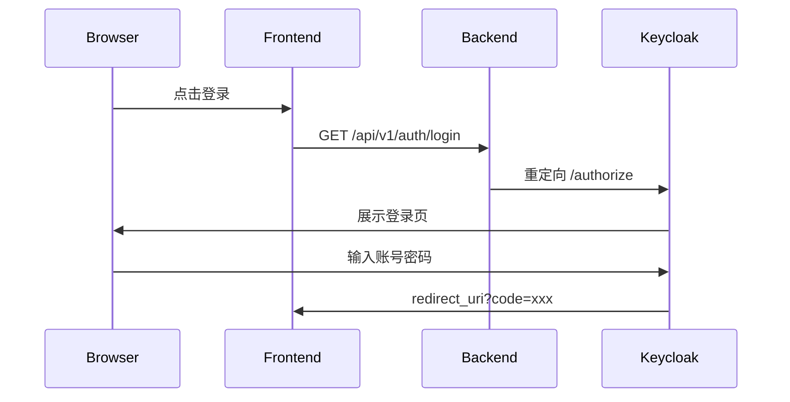
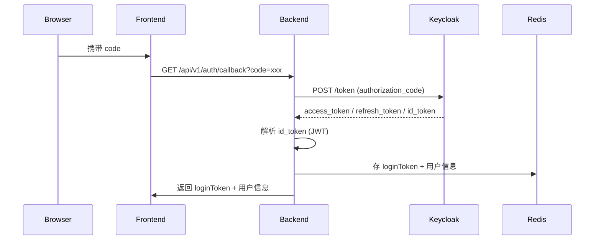
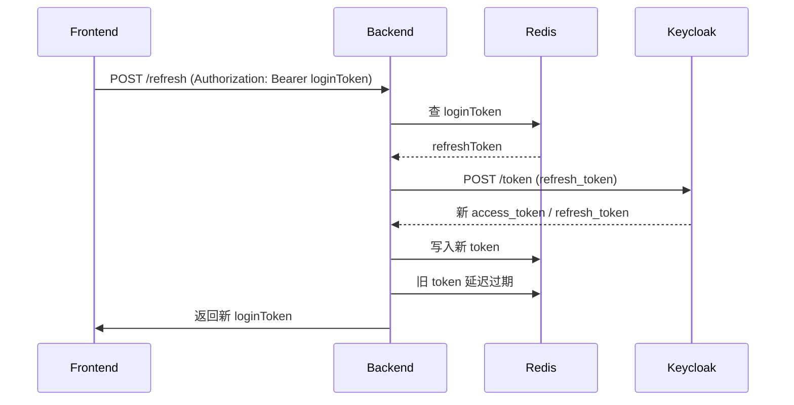
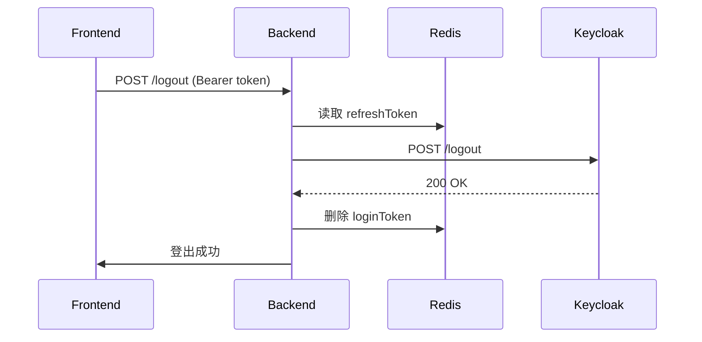

#### 环境初始化

- docker启动keycloak
```shell
docker run -d --name keycloak -p 8080:8080 -e KEYCLOAK_ADMIN=admin -e KEYCLOAK_ADMIN_PASSWORD=admin quay.io/keycloak/keycloak:25.0 start-dev
```
创建realm 
创建client
创建user


- docker启动redis

```shell
docker run -d --name my-redis -p 6379:6379 redis redis-server --requirepass "123456"
```


#### 交互流程

- jump to sso login



- sso login callback get token



- refresh token



- logout

